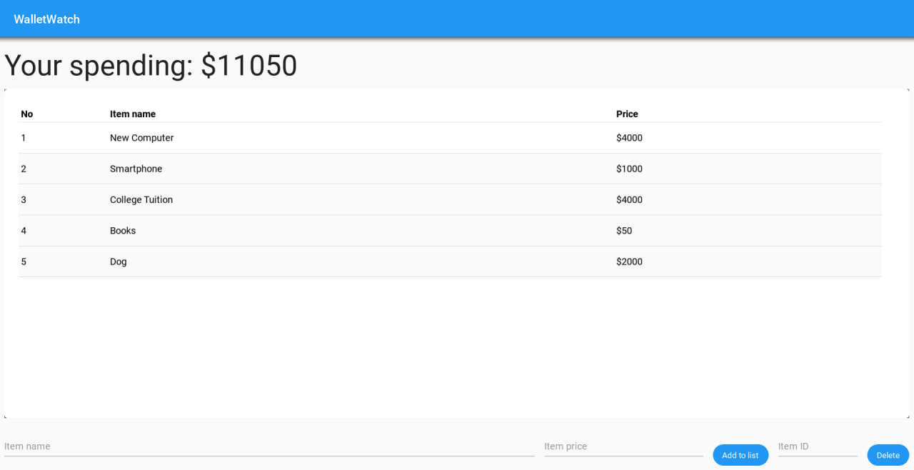

# WalletWatch

## What is it?
WalletWatch is an expense tracker that helps tracking your expense and provide many other smart expense tracking features.
## What does it use?
WalletWatch is using the [KivyMD](https://kivymd.readthedocs.io/en/1.1.1/) library in python for its GUI and [PostgreSQL](https://www.postgresql.org/) for its database.
## Installation
This installation walkthrough assumes you have a PostgreSQL database running/working.
1. Clone the repository
- `git clone https://github.com/Sopheakvethya/WalletWatch-Internship.git`
2. Change directory into the project
- `cd WalletWatch-Internship`
3.  Install packages
- `pip install -r requirements.txt`